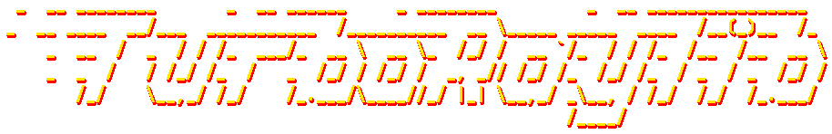
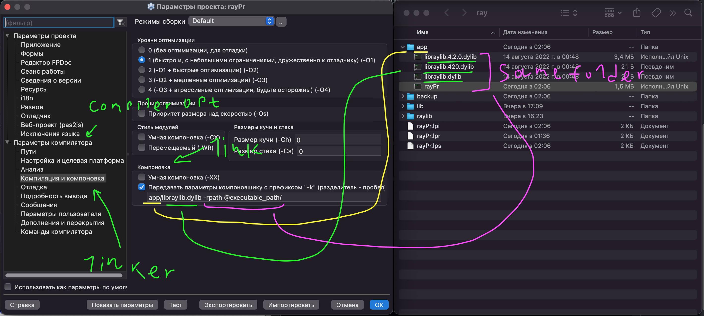
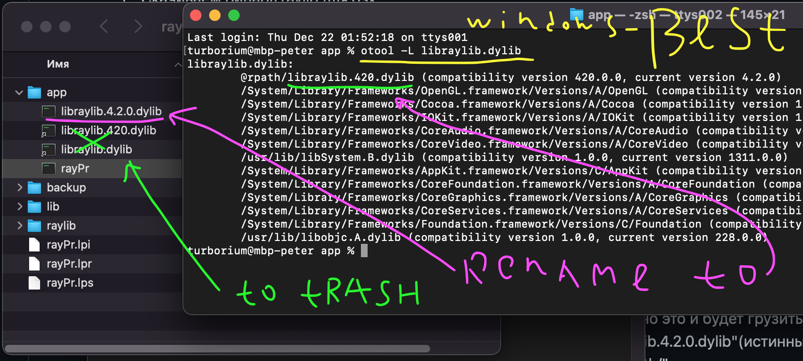

### **TurboRaylib is a cool and clean Raylib bindings for Object Pascal (Delphi and FreePascal)**

**TurboRaylib sticks to the stable versions of RayLib, the current version is 4.2.**  

Unlike other bindings, this version works stably in Win32 and Win64 in Delphi and Lazarus.  
The raylib library has a lot of ABI problems when using DLLs, all known problems have been fixed in these bindings.  
TurboRaylib has a lot of test coverage (see examples).  

**Foldes:**
- "raylib" - TurboRaylib bindings
- "binaries" - Dynamic libraries suitable for TurboRaylib bindings
- "examples" - Many examples for Delphi

You can download official DLL here: https://github.com/raysan5/raylib/releases/tag/4.2.0  

---

  
(See: https://github.com/turborium/TurboRaylib/blob/main/examples/shapes/shapes_logo_raylib_anim/shapes_logo_raylib_anim.dpr)

raylib is highly inspired by Borland BGI graphics lib and by XNA framework and it's specially well suited for prototyping, tooling, graphical applications, embedded systems and education.

**NOTE for ADVENTURERS:** *raylib is a programming library to enjoy videogames programming; no fancy interface, no visual helpers, no debug button... just coding in the most pure spartan-programmers way.* See: https://www.raylib.com/

---

**Modules**

Header     | Supported          |
---------  | ------------------ |
raylib.h   | :heavy_check_mark: |
raymath.h  | :heavy_check_mark: |
rlgl.h     | :heavy_check_mark: |

**Platforms**

Comiler     | Windows 32 | Windows 64 | OSX          | Linux        |
----------- | -------- | -------------| ------------ | ------------ |
Delphi      | ✔        | ✔           | ❓ no tested | ❓ no tested |
FreePascal  | ❓ no tested | ✔           | ✔       | ✔          |

---

### How to use?
Just add the "raylib" folder to your project, put the necessary dll next to the exe and get a fun!

**Notes:**
- Some Raylib functions require the use of pointers, don't forget to enable ```{$POINTERMATH ON}``` option in your source code! 
- Text strings in Raylib uses UTF8 format, but Delphi uses WideSrtirng, because wrap your string in ```UTF8String()```. Ex: ```UTF8String('My String')```.
- The examples are mostly converted for testing purposes and are not examples of good Object Pascal code.

### Заводим на Windows (Delphi/Lazarus)
1) Скачиваем бинарь raylib для Windows. (https://github.com/raysan5/raylib/releases).  
2) Скопируйте dll из папки /lib в место где расположен exe-шник вашего приложения.  
3) ???
4) PROFIT!  

### Заводим на OSX (Lazarus)
Первое - надо принять что UNIX создан для страдания.   
Второе - использование хоть чего-то не стандартного в UNIX это боль (например не С-89).  
Третье - динамические библиотеки в UNIX - боль.  
Главное - UNIX - SUXXX.  
UNIX-оводы, в большинстве своем, только делают вид что "знаю как все работает", по факту - выполняют набор магических ритуалов в консоли.

#### Меньше страданий
1) Скачиваем бинарь raylib для osx. (https://github.com/raysan5/raylib/releases).  
2) Копируем ВСЕ файлы из /lib в место где будет расположен бинарь вашего приложения. **(сюда и только сюда)**
3) Указываем линкеру что юзаем libraylib.dylib, а также говорим где искать бинарь либы:  
Пример для бинаря в папке /app:  
  
(Если вам повезет то вы не получите ошибку линковки, если не повезло - забейте и запустите windows)

#### Больше страданий
Так или иначе ваше приложение бдует связяанно с конкретной версией raylib, для начала надо понять с каким "именем".
1) скачиваем бинарный файл raylib для OSX.
2) распаковываем архив и открываем "lib"
3) запускаем "otool -L libraylib.dylib" из терминала (о да, каеф)  
  
Мы получили "истинное имя библиотеки" - "libraylib.420.dylib", именно это и будет грузить наше приложение.   
Если мы не хотим таскать с собой сразу 3 файла,   
то надо переименовать "libraylib.4.2.0.dylib"(истинный бинарь) в "libraylib.420.dylib" и передавать линкуру его.   
Ex: "libraylib.420.dylib -rpath @executable_path/".    
  
В целом "долбежка" описана тут: http://clarkkromenaker.com/post/library-dynamic-loading-mac/. И тут: https://habr.com/ru/post/220961/.      
И да - нам еще повезло что либа raylib собрана с корректным @rpath(да в XUIN каждая либа указывает откуда ее запускать лол), иначе без "патчинга" вообще ипользовать невозможно было бы.     
Почему истинный бинарь raylib обозван "libraylib.4.2.0.dylib", хотя внутри назван "libraylib.420.dylib" остаеться загадкой, возможно кто собирал - тоже не смог осознать "преимущества UNIX" и запутался.  
  
*Удачной долбежки!*
  
### Заводим на Linux (Lazarus)
Смотрите примеры, я завел и вы справитесь. Или нет, тогда поставьте Windows :)  

